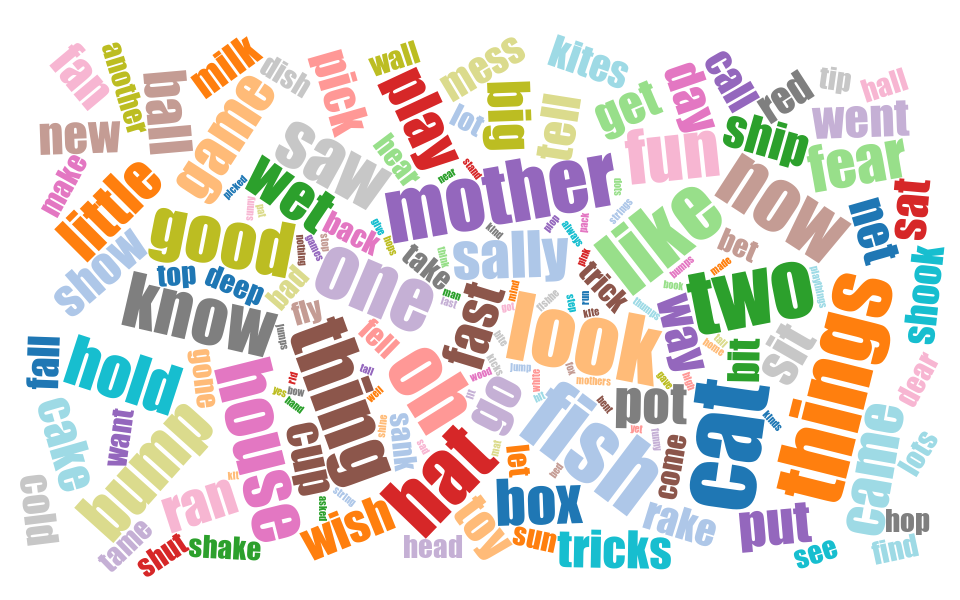

# WordFog

[](https://opensource.org/licenses/MIT)

A Ruby-on-Rails application to create and manage word clouds.  Uses the [magic_cloud gem](https://github.com/zverok/magic_cloud) in an ActiveJob worker (using Sidekiq by default).



## Table of Contents

* [Requirements](#requirements)
* [Installation](#installation)
* [Heroku deployment](#heroku-deployment)
* [Dokku deployment](#dokku-deployment)
* [ToDo](#todo)
* [License](#license)

## Requirements

* Ruby 2.7.4
* Rails 6
* Postgres
* Redis

## Installation

First, clone this repo.

```shell
% cd wordfog
% bundle install
% rails db:create
% rails db:migrate
% rails db:seed
% rails s
```

Navigate to localhost:3000 in a browser and then login with admin@example.com and password shown during seeding.

## Heroku deployment

```shell
% heroku create
% heroku addons:create heroku-postgresql:hobby-dev
% heroku addons:create heroku-redis:hobby-dev
% git push heroku main
% heroku run rails db:migrate
% heroku run rails db:seed
% heroku ps:scale web=1 worker=1
% heroku open
```

A browser window should open and then login with admin@example.com and password shown during seeding.

## Dokku deployment

On the dokku server:

```shell
% dokku apps:create wordfog
% dokku postgres:create wordfog
% dokku postgres:link wordfog
% dokku redis:create wordfog
% dokku redis:link wordfog wordfog
```

On your local client:

```shell
% git remote add dokku dokku@yourdokkuhost:wordfog
% git push dokku main:master
```

Back on the dokku server:

```shell
% dokku run wordfog rails db:migrate
% dokku run wordfog rails db:seed
% dokku ps:scale wordfog web=1 worker=1
```

Navigate to the dokku hosted app in a browser and then login with admin@example.com and password shown during seeding.

## ToDo

* Option on each fog to filter out noise words
* Options on each fog for magic_cloud parameters
* ~~Add logout link and style (with Bootstrap)~~
* "Still processing" message on each fog picture that is nil
* Problems with small input
* Fix requiring "RMagick" is deprecated. Use "rmagick" instead
* ~~Fix single column squeeze on fog edit form~~

## License

MIT license

Copyright 2021

Permission is hereby granted, free of charge, to any person obtaining a copy of this software and associated documentation files (the "Software"), to deal in the Software without restriction, including without limitation the rights to use, copy, modify, merge, publish, distribute, sublicense, and/or sell copies of the Software, and to permit persons to whom the Software is furnished to do so, subject to the following conditions:

The above copyright notice and this permission notice shall be included in all copies or substantial portions of the Software.

THE SOFTWARE IS PROVIDED "AS IS", WITHOUT WARRANTY OF ANY KIND, EXPRESS OR IMPLIED, INCLUDING BUT NOT LIMITED TO THE WARRANTIES OF MERCHANTABILITY, FITNESS FOR A PARTICULAR PURPOSE AND NONINFRINGEMENT. IN NO EVENT SHALL THE AUTHORS OR COPYRIGHT HOLDERS BE LIABLE FOR ANY CLAIM, DAMAGES OR OTHER LIABILITY, WHETHER IN AN ACTION OF CONTRACT, TORT OR OTHERWISE, ARISING FROM, OUT OF OR IN CONNECTION WITH THE SOFTWARE OR THE USE OR OTHER DEALINGS IN THE SOFTWARE.
